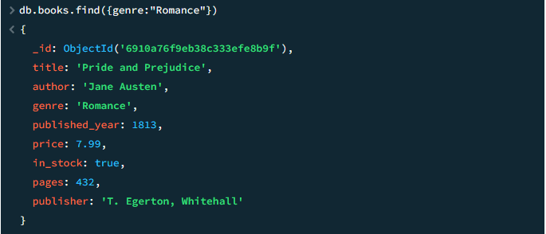
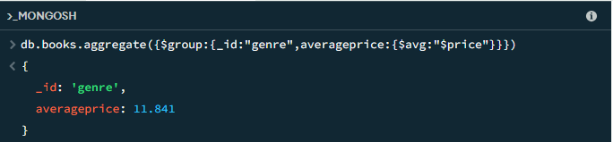

# MongoDB Fundamentals - Week 1

## Setup Instructions

Before you begin this assignment, please make sure you have the following installed:

1. **MongoDB Community Edition** - [Installation Guide](https://www.mongodb.com/docs/manual/administration/install-community/)
2. **MongoDB Shell (mongosh)** - This is included with MongoDB Community Edition
3. **Node.js** - [Download here](https://nodejs.org/)

### Node.js Package Setup

Once you have Node.js installed, run the following commands in your assignment directory:

```bash
# Initialize a package.json file
npm init -y

# Install the MongoDB Node.js driver
npm install mongodb
```

## Assignment Overview

This week focuses on MongoDB fundamentals including:

- Creating and connecting to MongoDB databases
- CRUD operations (Create, Read, Update, Delete)
- MongoDB queries and filters
- Aggregation pipelines
- Indexing for performance

## Submission

Complete all the exercises in this assignment and push your code to GitHub using the provided GitHub Classroom link.

## Getting Started

1. Accept the GitHub Classroom assignment invitation
2. Clone your personal repository that was created by GitHub Classroom
3. Install MongoDB locally or set up a MongoDB Atlas account
4. Run the provided `insert_books.js` script to populate your database
5. Complete the tasks in the assignment document

## Files Included

- `Week1-Assignment.md`: Detailed assignment instructions
- `insert_books.js`: Script to populate your MongoDB database with sample book data

## Requirements

- Node.js (v18 or higher)
- MongoDB (local installation or Atlas account)
- MongoDB Shell (mongosh) or MongoDB Compass

## Resources

- [MongoDB Documentation](https://docs.mongodb.com/)
- [MongoDB University](https://university.mongodb.com/)
- [MongoDB Node.js Driver](https://mongodb.github.io/node-mongodb-native/)

If you use Atlas, edit `insert_books.js` and replace the `uri` variable with your Atlas connection string.

3. Run the shell queries file with `mongosh`:

```powershell
mongosh "mongodb://localhost:27017/plp_bookstore" --file .\queries.js
```

Alternatively, start an interactive shell and `load()` the file:

```powershell
mongosh "mongodb://localhost:27017/plp_bookstore"
# then, inside mongosh:
load('queries.js')
```

4. Example: measuring index improvement with `explain()` (run in `mongosh`):

```javascript
// before creating an index
db.books.find({ title: "The Hobbit" }).explain("executionStats");

// create an index
db.books.createIndex({ title: 1 });

// after creating the index
db.books.find({ title: "The Hobbit" }).explain("executionStats");
```

Look at `executionStats.totalDocsExamined` and `executionStats.executionTimeMillis` to see the improvement.

---

## Image examples

Below is a small illustrative image showing a mocked example of `find()` output before and after executing. It demonstrates how `totalDocsExamined` typically drops when a selective index is used.






